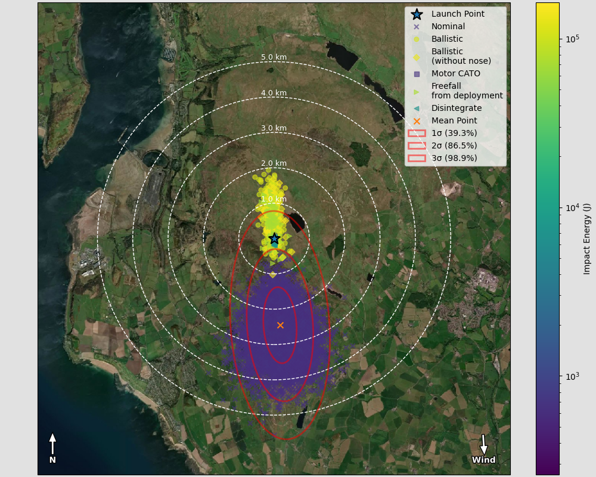
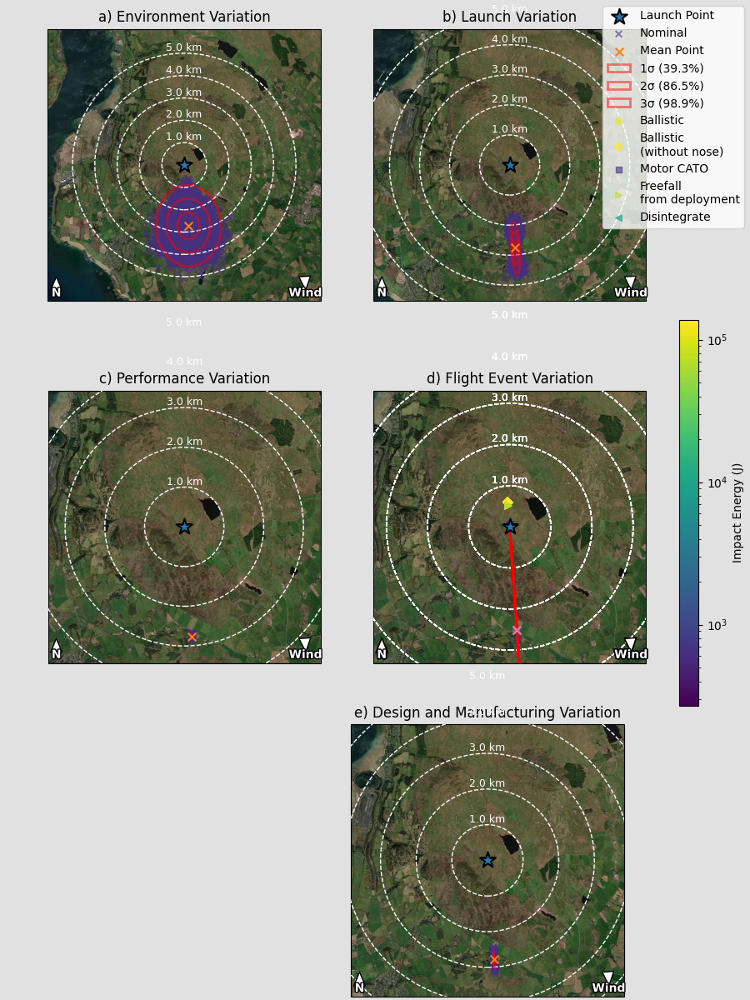
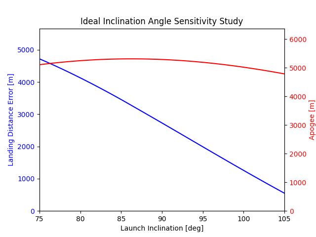

# Sub-Orbital Rocket Dispersion Analysis

This project aims to model all uncertainty in sub-orbital rocketry launches typical of student and amateur rocket teams to predict dispersion, failure cases, and design sensitivity, and to help develop and support the safety case for launches.

This project builds on the excellent [RocketPy](https://rocketpy-team.github.io) project and extends the existing Monte Carlo model to quickly analyse unknown uncertainty using standard variance, defined variance, probability-based failure modes, and tools and methods to make it easier to estimate or calculate the parameters needed for rocket modelling.

## Getting Started

Assuming you have a working Python 3.12+ installation, you can get started with the following steps.

1. Clone this repository to your device
2. Install Python dependencies using ```pip install -r requirements.txt``` within the project root
3. Set up free [Map Box](https://www.mapbox.com/) account and save API key in """keys.env""" as """MAPBOX_ACCESS_TOKEN=[INSERT TOKEN]""". This is required to get satellite data.
3. Run one of the provided sample scripts, [l4c.py](l4c.py), [lpr.py](lpr.py), [lymm_weather_analysis.py](lymm_weather_analysis.py), [test_mpr.py](test_mpr.py), [ukroc.py](ukroc.py)

## Sample Outputs

### Visual Representation of Rocket


### Dispersion analysis of a rocket with failure modes and impact energy



### Dispersion analysis impact of different sources of uncertainty



### Launch angle impact on ideal landing distance from launch point



### Historical Wind Gust Speed


### Historical Wind Speed Profile


## Helper Tools

### Airfoil Scripts

[airfoil_scripts.py](airfoil_scripts.py) contains a suite of tools to help generate .DAT profiles for fin airfoils. These can then be imported into [xFoil](https://web.mit.edu/drela/Public/web/xfoil/) to generate lift coefficient versus angle of attack for custom airfoils.

> Please note this is an advanced process, and an understanding of xFoil and its limitations will be needed to get accurate aerodynamic performance. Flat plate approximations are usually sufficient, or you can use similar known data.

### Working with ECMWF Climate Data

[environmental_analysis.py](environmental_analysis.py) is a script to help download the correct historic weather data from the Copernicus Climate Data Store for a rocket launch in a given location. This script also contains tools for converting the data to a format RocketPy can read and for plotting common atmospheric rocketry graphs.

> Before using this script you must change the parameters to your desired altitude, time and location. You must also create an account, download the cdsapi tool and the follow the setup process, see [documentation here](https://cds.climate.copernicus.eu/how-to-api). You must ensure you comply with the terms of use and request only the minimum data required for your application.

This script contains example usage at the end.

### Cache Reader

[cache_reader.py](cache_reader.py) can be used to cache saved dispersion analysis data for further analysis. Recommended for long-running/computationally expensive simulations.

> Cache can be saved with ```SimOutput.save("cache-name.cache")```

### Drag Coefficient Estimation

To avoid having to measure drag coefficients in a wind tunnel. The method described in [appendix A](docs/) can be used to approximate the performance using the RAS Aero II program based on existing aerodynamic data. [extract_drag_curves.py](extract_drag_curves.py) can then be used to extract the useful data from this program.

<!-- TODO Link to pdf -->

### Inertia Estimation

If the moments of inertia for your rocket are unknown, they can be approximated using the method described in [appendix B](docs/) in OpenRocket, assuming equal moments of inertia along the lines of symmetry.

<!-- TODO Link to pdf -->

## Documentation

Where documentation has not been included on this page, it is provided as comments in the scripts, within example scripts or separate linked documentation.
